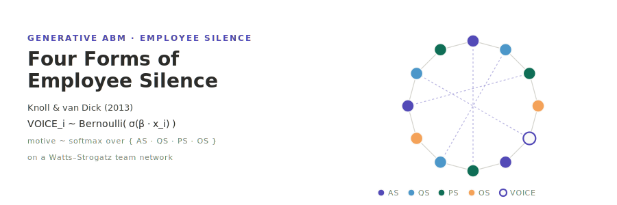

<p align="center"></p>

**English** | [日本語](README.ja.md)

# Knoll & van Dick (2013) — Four Forms of Employee Silence

A two-track replication of **Knoll & van Dick (2013), "Do I Hear the Whistle…? A First Attempt to Measure Four Forms of Employee Silence and Their Correlates"** (*Journal of Business Ethics*, 113(2), 349–362; DOI: 10.1007/s10551-012-1308-4).

- **Track A — psychometric replication** (Python `knoll-tools`): EFA / CFA / α / nomological-r-matrix analyses of an independent sample.
- **Track B — generative ABM** (Rust `knoll` on the [socsim](https://github.com/akitenkrad/rs-social-simulation-tools) library): a 4-motive silence simulation on a Watts–Strogatz team network. A **rule** decision mode (multinomial-logistic ablation) and an **LLM** decision mode (`socsim-llm`, Ollama-first → OpenAI fallback) are mutually exclusive via `--decision-mode {rule|llm}`.

The Phase Status table below records what is implemented in this scaffold vs deferred to subsequent phases. The full design lives in the Obsidian note `研究/98_論文レポート/80-再現実装/Do I hear the whistle…- A first attempt to measure four forms of employee silence and their correlates.md`.

## Phase Status

| Phase | Track | Description | Status |
|-------|-------|-------------|--------|
| 0     | shared | Repository scaffold + socsim git deps + bilingual docs | ✓ done |
| A1    | A | Survey instrument translation + IRB protocol | stub only (`survey/` placeholders) |
| A2    | A | Pilot N≈30 collection | not started |
| A3    | A | Main study N≈400 collection + descriptive stats | tooling ready (synthetic-data smoke); real data deferred |
| A4    | A | EFA + competing-models CFA + α + Table 2 r matrix | tooling ready; real data deferred |
| A5    | A | Robustness + multigroup (EN vs JA) invariance | tooling ready; real data deferred |
| **B1** | **B** | **Rule-mode (multinomial-logistic) baseline + 9 mechanisms** | ✓ **done** |
| **B2** | **B** | **LLM-mode (`socsim-llm`) + sweep + visualize / visualize-sweep** | ✓ **done** |
| B3    | B | 12-item reflexive self-rating emission + population CFA emergence | stub (`knoll reproduce`) |
| X     | both | 3-way paper / Track A / Track B comparison in `reproduce_paper.py` | stub |

This scaffold delivers Phase 0 + Phase B1 + Phase B2 (everything needed for the rule-mode and LLM-mode silence dynamics to run end-to-end) plus the full Track A Python tooling, smoke-testable against a `--synthesize-n` fallback. Phase A1–A5 real-data collection and Phase B3/X analyses are deferred and scoped explicitly above.

## Two-layer determinism

LLM output is **outside** socsim's bit-reproducibility, so the design splits into two layers:

- **Deterministic socsim core** — employee initialisation, Watts–Strogatz network generation, scheduling, the 8 non-decision mechanisms, the rule-mode `voice_decision_rule`. Given a seed this reproduces bit-for-bit. The `--decision-mode rule` path lives entirely here and makes **zero LLM calls**.
- **Non-deterministic LLM layer** — `voice_decision` only. Pseudo-determinised by `socsim-llm`'s `CachingClient` (a `hash(prompt+model)` → response cache), `temperature=0` and a fixed `(agent_id, t)`-derived seed. Provider order is **Ollama first → OpenAI fallback** via `socsim-llm`'s `FallbackClient`.

The cache — not the model — is the reproducibility mechanism: a warm cache replays identical responses. Each run writes `run_metadata.json` recording decision mode / model / endpoint / temperature / seed / cache-hit rate.

## Install & Quick start

```bash
# Build the Rust simulation (fetches socsim incl. socsim-llm with Ollama+OpenAI backends).
cargo build --release

# === Rule mode (no LLM) — Phase B1 ablation baseline ===
cargo run --release -- run --decision-mode rule \
    --n-teams 8 --team-size 12 \
    --motive-prior-as 0.22 --motive-prior-qs 0.27 \
    --motive-prior-ps 0.40 --motive-prior-os 0.18 \
    --prosocial-climate-decoupling \
    --t-max 36 --runs 30 --seed 42

# === LLM mode (Ollama first) — Phase B2 ===
#   ollama pull llama3.1
export OLLAMA_HOST=http://localhost:11434
export OLLAMA_MODEL=llama3.1
cargo run --release -- run --decision-mode llm \
    --llm-cache-path runs/knoll_cache.json \
    --t-max 36 --runs 10 --seed 42

# === Sensitivity sweep (β group × prosocial_decoupling × seeds) ===
cargo run --release -- sweep \
    --beta-psafety-values "0.6,1.2,2.0" \
    --beta-fear-values    "0.5,1.5,2.5" \
    --beta-rho-ps-values  "0.0,0.1,0.3" \
    --runs 20 --seed 42

# Python visualization & analysis tools (workspace root)
uv sync
uv run knoll-tools visualize                          # motive_mix + KL + motive×climate bar
uv run knoll-tools visualize-sweep                    # β heatmap + PS-decoupling response curve
uv run knoll-tools show-experiment-settings           # config / sweep_config / run_metadata

# === Track A synthetic-data smoke (no real data required) ===
uv run knoll-tools survey-loader --synthesize-n 200 --sample synth
uv run knoll-tools descriptive-stats     --sample synth
uv run knoll-tools efa-4factor           --sample synth --rotation varimax
uv run knoll-tools reliability-analysis  --sample synth
uv run knoll-tools nomological-network   --sample synth --bootstrap 500
uv run knoll-tools cfa-competing-models  --sample synth --models M1,M2,M3,M3b,M4
```

## Repository layout

```
knoll2013/
├── simulation/                       # Track B (Rust socsim ABM)
│   ├── Cargo.toml                    # socsim-{core,engine,net,mechanisms,metrics,llm,results} git deps
│   ├── src/
│   │   ├── lib.rs / main.rs          # CLI: run / sweep / reproduce
│   │   ├── config.rs                 # Config / DecisionMode / BetaGroup / MotivePrior / NetworkKind
│   │   ├── world.rs                  # SilenceWorld + Employee + Team + Motive + Expression
│   │   ├── mechanisms.rs             # 9 mechanisms × 6 phases; rule vs LLM decision (mutually exclusive)
│   │   ├── prompts.rs                # LLM persona templates + decision JSON parser
│   │   ├── llm.rs                    # socsim-llm shared-harness re-export shim
│   │   ├── simulation.rs             # init_world + run_with_client + CSV/JSON writers
│   │   └── metrics.rs                # silence_rate / motive_mix / climate / KL / Pearson r
│   └── tests/integration_test.rs     # rule + scripted-LLM smoke tests
├── tools/                            # Python knoll-tools (Track A + Track B)
│   └── src/knoll_tools/{cli,visualize,visualize_sweep,show_experiment_settings,
│                        survey_loader,descriptive_stats,efa_4factor,cfa_competing_models,
│                        reliability_analysis,nomological_network,discriminant_validity,
│                        robustness_checks,multigroup_cfa,cfa_analysis,reproduce_paper}.py
├── survey/                           # Track A instrument stubs (placeholders pending IRB / translation)
│   ├── knoll_12item_en.yaml / knoll_12item_ja.yaml
│   ├── translation_log.md            # Brislin 1970 process placeholder
│   └── irb_protocol.md               # IRB submission placeholder
├── docs/                             # bilingual: architecture, cli, usecases, visualization, reproduction
├── data_external/                    # raw survey CSVs (gitignored — never commit)
└── results/                          # runtime outputs (gitignored)
    ├── latest -> {YYYYMMDD_HHMMSS}/
    └── {YYYYMMDD_HHMMSS}/
        ├── config.json | sweep_config.json
        ├── metrics.csv               # t, silence_rate, motive_mix_{AS,QS,PS,OS}, climate, KL, …
        ├── agents.csv                # final-step per-agent state
        ├── correlations.csv          # 4 motive × 6 correlate final-step Pearson r
        ├── run_metadata.json         # LLM provenance + cache-hit rate
        └── (Phase B2 sweep) sweep_summary.csv
```

## Documentation

- [Architecture](docs/architecture.md) — world state, 9-mechanism × 6-phase table, two-track diagram
- [CLI reference](docs/cli.md) — `run` / `sweep` / `reproduce` flags
- [Usecases](docs/usecases.md) — Track A vs Track B use cases
- [Visualization](docs/visualization.md) — what the Python tools produce
- [Reproduction](docs/reproduction.md) — Phase mapping vs the Knoll 2013 Study 1 / 2 numbers

## References

- Knoll, M., & van Dick, R. (2013). Do I Hear the Whistle…? A First Attempt to Measure Four Forms of Employee Silence and Their Correlates. *Journal of Business Ethics*, 113(2), 349–362.
- Simulation engine: [socsim (rs-social-simulation-tools)](https://github.com/akitenkrad/rs-social-simulation-tools).

## License

MIT — see [LICENSE](LICENSE).

---
*This file was generated by Claude Code.*
